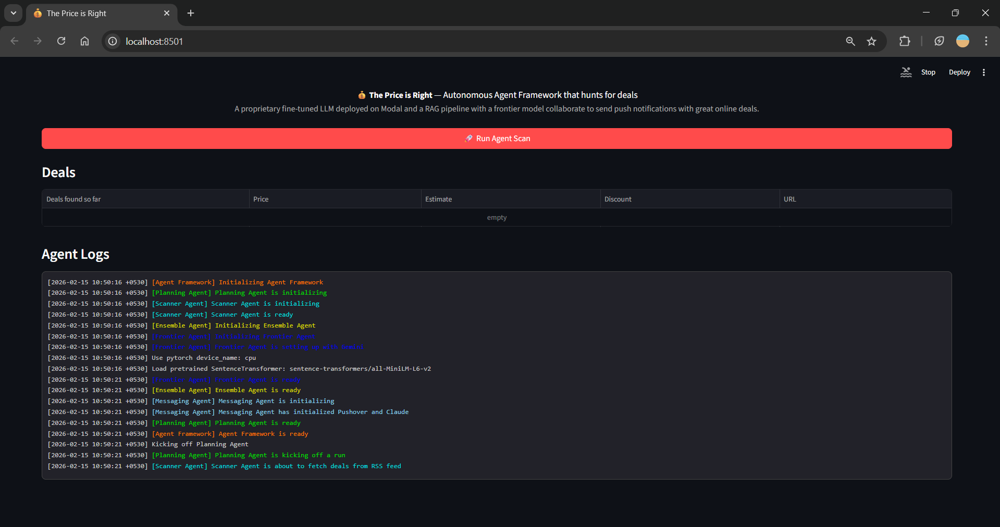
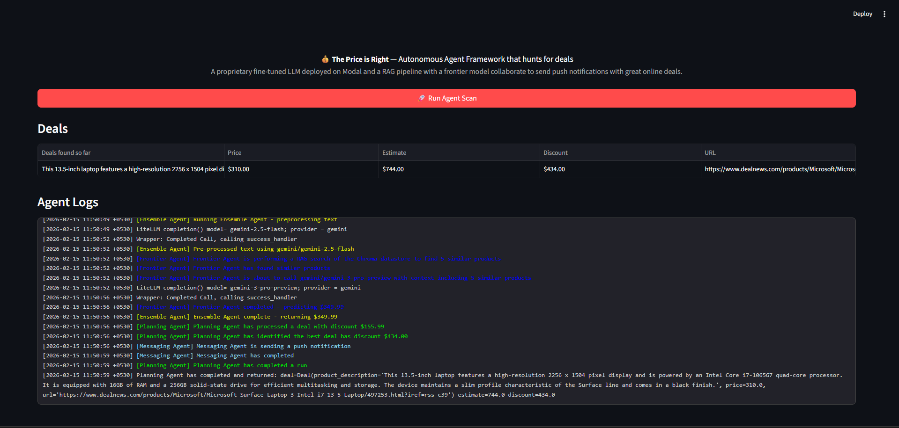

# 💰 The Price is Right — Autonomous Deal-Hunting AI

### An **autonomous multi-agent framework** that continuously monitors online deal feeds, estimates true product values using an ensemble of AI models, and sends push notifications when it finds significant discounts.

### Check the deployment at -> https://priceisright.streamlit.app/




## Architecture

```
UI (Streamlit)
  └─► Agent Framework (memory, logging, orchestration)
        └─► Planning Agent (coordinates the pipeline)
              ├─► Scanner Agent — scrapes RSS feeds, uses Gemini to shortlist deals
              ├─► Ensemble Agent — aggregates price estimates from:
              │     ├─ Frontier Agent (RAG + Gemini with ChromaDB vector search)
              │     ├─ Specialist Agent (fine-tuned LLM deployed on Modal)
              │     └─ Neural Network Agent (custom PyTorch DNN)
              └─► Messaging Agent — sends push notifications via Pushover
```

## Tech Stack

| Layer | Technologies |
|-------|-------------|
| **LLMs** | Gemini 3 Flash / Pro (via LiteLLM), fine-tuned LLM on Modal |
| **RAG** | ChromaDB vector store, Sentence-Transformers (`all-MiniLM-L6-v2`) |
| **Deep Learning** | Custom PyTorch deep neural network for price regression |
| **Data** | RSS feed scraping (DealNews), BeautifulSoup, Feedparser |
| **Notifications** | Pushover push notifications |
| **Visualization** | Plotly 3D scatter (t-SNE reduced embeddings) |
| **UI** | Streamlit (deployable), Gradio (local dev) |

## How It Works

1. **Scan** — The Scanner Agent fetches deals from electronics/computers RSS feeds and uses Gemini to extract the top 5 most promising deals with structured outputs.
2. **Price** — The Ensemble Agent estimates each product's true market value by combining a RAG-powered frontier model (retrieves 5 similar products from a vector DB of 10K+ items) with a fine-tuned LLM and a custom neural network.
3. **Alert** — If the discount exceeds $50, the Messaging Agent crafts a notification and sends a push alert to your phone.

## Quick Start

```bash
# Install dependencies
pip install -r requirements.txt
pip install streamlit pandas

# Set up environment variables in .env
# PUSHOVER_USER=...
# PUSHOVER_TOKEN=...
# GEMINI_API_KEY=...

# Run
streamlit run price_is_right_streamlit.py
```

## Project Structure

```
├── price_is_right_streamlit.py   # Streamlit UI (deployable)
├── price_is_right.py             # Gradio UI (local dev)
├── deal_agent_framework.py       # Core framework: orchestration, memory, logging
├── agents/
│   ├── planning_agent.py         # Coordinates Scanner → Ensemble → Messenger
│   ├── scanner_agent.py          # RSS scraping + Gemini deal selection
│   ├── ensemble_agent.py         # Aggregates multiple pricing models
│   ├── frontier_agent.py         # RAG pipeline: ChromaDB + Gemini
│   ├── specialist_agent.py       # Fine-tuned LLM on Modal (serverless)
│   ├── neural_network_agent.py   # PyTorch DNN inference
│   ├── deep_neural_network.py    # DNN model definition & training
│   ├── messaging_agent.py        # Pushover push notifications
│   ├── deals.py                  # Data models & RSS feed scraper
│   └── preprocessor.py           # Text preprocessing for models
├── products_vectorstore/         # ChromaDB persistent vector store
└── deep_neural_network.pth       # Trained DNN weights
```
